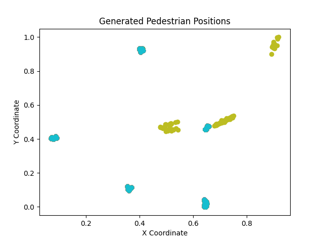

# Pedestrian Trajectory Generation and Visualization

This project trains a UNet1D model on the pedestrian dataset to generate new samples of pedestrian trajectories. The generated samples are saved to a CSV file, and the trajectories of the pedestrians from the generated dataset are visualized using Matplotlib.

## Requirements

- Python
- PyTorch
- Matplotlib
- Numpy
- Pandas

## Project Structure

- `train.py`: Contains the script for training the model on the pedestrian dataset.
- `sampling.py`: Contains the function to generate new samples using the trained model.
- `utils.py`: Contains utility functions for visualizing and saving the generated samples.
- `models/unet.py`: Contains the UNet1D model used for generating the samples.
- `dataset/plot_dataset.py`: Contains the script for plotting the trajectories of the pedestrians from the generated dataset.

## Usage

1. Train the model and save the weights to a `.pth` file, which is saved in the `Checkpoints` directory, and will be used for generating new samples.
2. Run `sampling.py` to generate new samples using the trained model. The generated samples are saved to a CSV file in the 'Generated_Positions_Data' directory. The generated samples are saved in the format 'generated_pedestrians_epoch_{}.csv', where {} is the epoch number.
3. Run `dataset/plot_dataset.py` to visualize the generated samples in the CSV file. The script will plot the trajectories of the pedestrians from the generated dataset, and save the plots to the 'Images' directory.

## Results
- The following images show the nomalized trajectories of the pedestrians from the generated dataset at different epochs.

  

  

  

  

  

- The following images show the trajectories of the original pedestrians from the dataset.

  

- The following images show the trajectories of the pedestrians from the generated dataset at different epochs.

  

  

  

  

  

